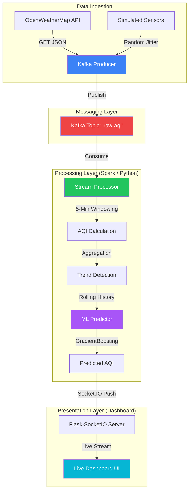

# 🌫️ Live Air Quality Monitoring & ML System

A production-grade, real-time streaming pipeline that ingests live world-wide pollution data, computes AQI levels, detects trends (↑ ↓ →), and uses machine learning to predict next-hour values. Featuring a beautiful dark glassmorphism dashboard.

---

## 🏛️ Architecture & Data Flow



---

## 🚀 Key Improvements & Features

*   **⚡ Instant History Pre-Fill**: The dashboard starts with a **full 20-minute graph** immediately (no more starting from an empty chart).
*   **🤖 Startup AI Predictions**: The `GradientBoostingRegressor` model is active from the first second of operation.
*   **🎭 Demo Mode Switch**: An on-screen toggle to switch between **Accurate API Data** and **Dramatic Simulation** (fixes the "flat line" problem for better visual demonstrations).
*   **📡 Hybrid Pipeline**: Supports both **Pure-Python Simulation** (1 terminal) and **Full Kafka/Spark Infrastructure** (3 terminals).
*   **📈 Smart Trend Detection**: Real-time slope calculation to see if pollution is rising or falling over the last 5 minutes.

---

## 📦 Setup & Requirements

**Prerequisites:**
*   Python 3.9+
*   Docker & Docker Compose (Required for Production Kafka Mode only)
*   An [OpenWeatherMap API Key](https://openweathermap.org/) (Free tier works perfectly)

**1. Create a `.env` file** in the project root containing your API key:
```ini
OPENWEATHER_API_KEY=your_api_key_here
```

**2. Python Dependencies (`requirements.txt`)**
Our lightweight stack runs on event-driven streaming and scikit-learn:
```text
# Core Streaming
pyspark==3.5.1
kafka-python==2.0.2

# Web Dashboard (Async Eventlet)
flask==3.0.3
flask-socketio==5.3.6
eventlet==0.36.1

# Machine Learning & Math
scikit-learn==1.4.2
numpy==1.26.4
pandas==2.2.2
joblib==1.4.2

# HTTP / Utilities
requests==2.32.3
python-dotenv==1.0.1
```

---

## 🛠️ Quick Start (Simulation Mode — 1 Terminal)

*Best for local testing and checking the AI/UI without setting up infra.*

1.  **Activate Environment & Install**:
    ```powershell
    venv\Scripts\Activate
    pip install -r requirements.txt
    ```
2.  **Ensure Simulation Mode is ON**:
    In `config/settings.py` set: `SIMULATION_MODE = True`
3.  **Launch the System**:
    ```powershell
    python dashboard/app.py
    ```
4.  **View Dashboard**: Open [http://localhost:5001](http://localhost:5001) in your browser.

---

## 🏗️ Production Setup (Kafka Pipeline — 3 Terminals)

*The "Proper" way to run the full engineering stack.*

1.  **Terminal 1 — Infrastructure**:
    ```powershell
    docker-compose up -d
    ```
2.  **Terminal 2 — Data Producer**:
    ```powershell
    venv\Scripts\Activate
    python producer/aqi_producer.py
    ```
3.  **Terminal 3 — Dashboard/Consumer**:
    ```powershell
    # Ensure config/settings.py → SIMULATION_MODE = False
    venv\Scripts\Activate
    python dashboard/app.py
    ```
4.  **View Dashboard**: See data flowing through Kafka UI at [http://localhost:8080](http://localhost:8080) and charts at [http://localhost:5001](http://localhost:5001).

---

## 🔬 Deep Dive: The Spark Layer

In the production pipeline (`spark/aqi_stream_processor.py`), Apache Spark does the heavy lifting to ensure the data is statistically significant and clean before reaching the dashboard:

1.  **📊 5-Minute Tumbling Windows**: Spark groups raw readings into 5-minute blocks based on their event time. 
2.  **📈 Real-Time Aggregation**: Instead of just passing data through, it computes:
    *   `avg_aqi`: The average AQI for each city within the window (smooths out sensor noise).
    *   `max_aqi` / `min_aqi`: Identifies the highest/lowest pollution spikes in that period.
    *   `reading_count`: Tracks how many sensor packets were successfully received.
3.  **⏳ Watermarking**: It handles "late" data (up to 10 minutes delayed) by checking timestamps. This ensures that even if a sensor connection is spotty, the windowed average remains accurate. **Watermark of 10 minutes was chosen to balance late data tolerance and real-time responsiveness.**
4.  **⚡ UDFs (User-Defined Functions)**: Uses custom Python logic within the Spark cluster to perform the EPA-standard PM2.5 to AQI linear interpolation at scale.

---

## 📂 Project Structure

```
LIVE_AQI/
├── config/             ← Central settings (Cities, Kafka ports, Simulation flag)
├── producer/           ← Sensor data generator (API & Simulation modes)
├── spark/              ← Streaming logic (Kafka consumers and data processing)
├── ml/                 ← ML Training (`aqi_predictor.py`) and Inference Engine
├── dashboard/          ← Flask + SocketIO backend & Frontend UI
├── docker-compose.yml  ← Infrastructure (Kafka, Zookeeper, Spark UI)
├── requirements.txt    ← Python dependencies
└── whatfixed.md        ← Technical log of solved engineering challenges
```

---

## 📊 AQI Reference Scale (US EPA)

| AQI | Category | Visualization |
|-----|----------|---------------|
| 0–50 | 🟢 Good | Low risk to health |
| 51–100 | 🟡 Moderate | Minor sensitivity risk |
| 101–150 | 🟠 Sensitive | Unhealthy for sensitive groups |
| 151–200 | 🔴 Unhealthy | Everyone may feel health effects |
| 201–300 | 🟣 Very Unhealthy | Health alert for everyone |
| 300+ | 🔴 Hazardous | Critical health emergency |

---

## 👤 Developer Notes

*   **API Configuration**: To use live data, ensure your **OpenWeatherMap API Key** is present in the `.env` file.
*   **Visualizing Movement**: If real-world air feels too "flat" and stable, click the **Demo Mode** button in the dashboard header for more dramatic, simulated fluctuations!
